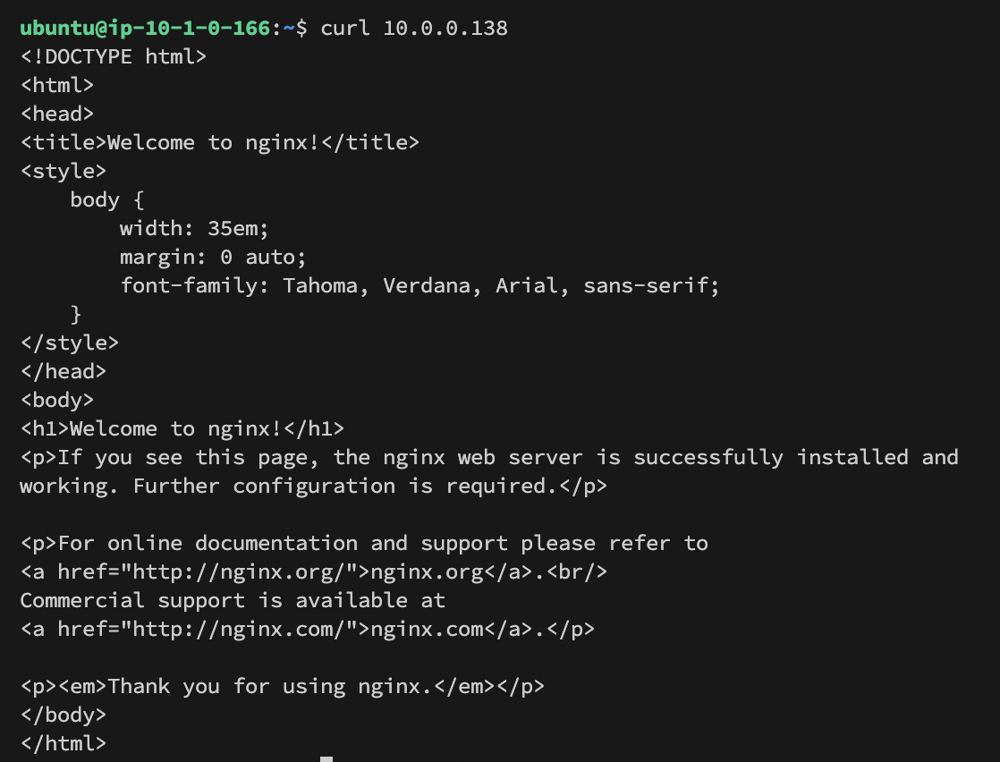

### 執行步驟

1. terraform iniy
2. terraform plan
3. terraform apply

整個過程可以用預設參數完成，
IP WAF 驗證部分，透過

```
data "http" "myip" {
  url = "http://ipv4.icanhazip.com"
}
```

去得到自己的 public ip 做阻擋。

### Components

- vpc 部分使用 vpc resource 跟 vpc module 完成功能，但做到後面覺得這樣寫不一致，如果下次寫，應該會考慮整個 terraform 都用 module 或都用 source。
- WAF 部分使用 `aws_wafv2_web_acl` 這個 source，目前還不太確定跟舊版 `aws_waf_web_acl` 除了寫法上的差別外有什麼不同。
- peering 部分使用 `aws_vpc_peering_connection` 並且設定 `auto_accept = true`，可以在同個帳號下自動 accept peering 的請求。
- ec2 部分我把他包成 module，並且 ingress 簡單的設定成了開啟 `22` 跟 `80` port，如果要嚴格實踐的話，可能還要把 security group id 作為 variable 另外傳入。
- ec2 的 ami 透過 data source 去取得，利用 filter 語法，抓到 ubuntu 的特定版本的 id。

#### 驗證：

- `right subnet curl left subnet`
  
- `left subnet curl right subnet`
  
- `curl by other ip`
  
- `curl by my ip`
  
- `ratelimit response`
  
